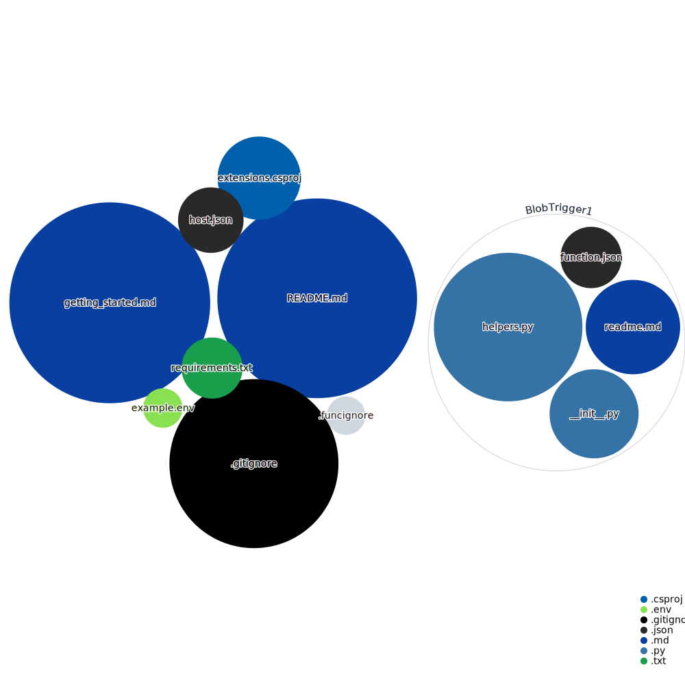

This Azure Function is triggered by a new blob being added to a container in the storage account. The Function will process that blob, and convert it before saving it to another container in the same storage account.

## Prerequisites
Install Azure Functions Core Tools version 3.x, and Python 3.6 or later. See [Local development guide](https://docs.microsoft.com/azure/azure-functions/functions-develop-local) for details.

## Running the sample
1. Create a Resource Group in the Azure portal.
1. Create a new storage account in the Azure portal.
1. Create a new source container in the storage account. This is where you will upload the initial file. Make sure this is a private container.
1. Create a new destination container in the storage account. This is where the processed file will be saved. Make sure this is a private container.

1. Create an App Service Plan to host your Function App.
1. Create a new Function App in the Azure portal. Make sure to select the same Resource Group and App Service Plan you created in the previous steps.

1. Ensure you have the Azure Functions extension installed in VS Code.
1. Navigate to a VS Code cloned window of this repo on your local machine.
1. There will likely be a popup in VS Code asking you to select a Python interpreter. Select the Python 3.10.

1. Configure all of the environment variables in the example.env into the App Service Plan Configuration in the Azure portal. You can find the App Service Plan Configuration in the Azure portal by navigating to your Function App, and selecting Configuration under Settings. You can find the environment variables in the example.env file in this repo.
1. Update the function.json path value beginning to match your source container name. For example, if your source container is called "source", then the path should be "source/{name}".
1. You can also test this Function locally by creating a local .env file, and updating the local.settings.json with the appropriate YOUR_STORAGE_CONNECTION_STRING value.

1. Publish the Azure Function to Azure. You can do this by selecting the Azure Function in the Azure Functions extension in VS Code, and selecting "Deploy to Function App". Make sure to choose your previously created Function App.

1. Once the Function is deployed, test it by uploading a file to the source container in the storage account. You can do this by navigating to the storage account in the Azure portal, selecting the source container, and selecting Upload. Upload any file you want, and then navigate to the destination container to see the processed file.